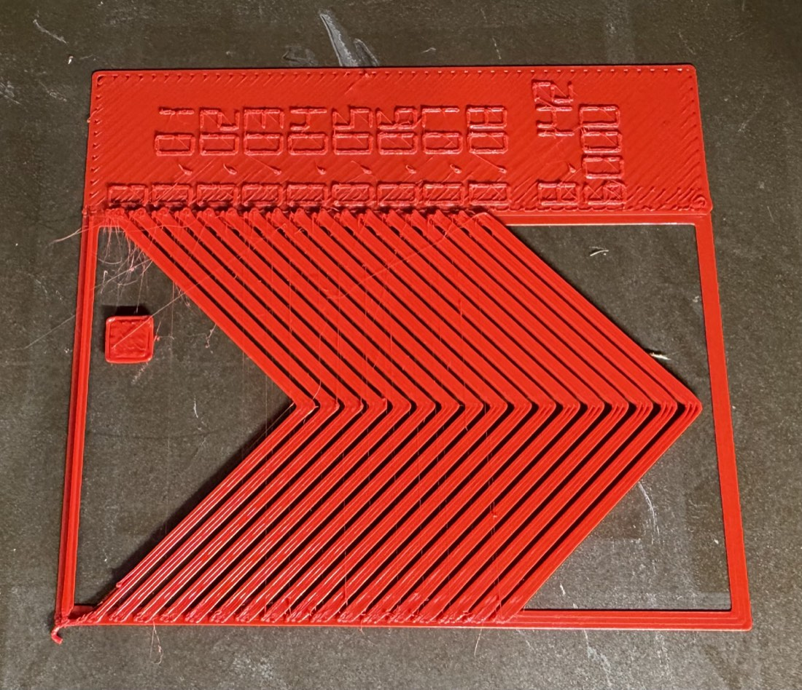
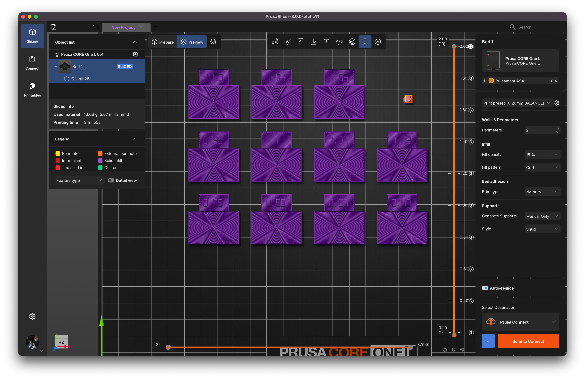

# Calibration Plugin for PrusaSlicer 3

Printer calibration tools for the Lua plugin system introduced in PrusaSlicer 3.0.

## Plugins

The `build.erik.calibration` bundle contains:

- **PA Pattern** — the Ellis pressure-advance calibration pattern:
  V-chevrons printed at stepped PA values with printed value labels.
  Pick the chevron with the crispest corner; its label is your PA value —
  enter it under *Filament → Extrusion & Calibration → Pressure advance*.
  Supports Marlin, Marlin 2,
  Prusa Buddy, Klipper, RepRapFirmware, and Repetier dialects, detected
  automatically from the printer profile with a manual override.
- **Flow Ratio** — OrcaSlicer's YOLO flow calibration: a plate of
  Orca-standard coupons, each printed at a stepped flow multiplier and
  labeled with the resulting absolute value. Pick the coupon with the
  smoothest top surface; its label is your new extrusion multiplier —
  enter it under *Filament → Filament → Extrusion multiplier*. Pure
  `G1` output, so it works on every firmware.
- **Retraction** — OrcaSlicer's retraction tower: two slender posts whose
  connecting travel retracts 0.1 mm more per 1 mm of height (0 to 2 mm by
  default). Find the height where strings between the posts stop, measure
  the clean millimeters above the 0.4 mm base, and divide by 10 — enter
  the result under *Printer → Extruder → Retraction → Length*. Pure `G1`
  output; the retraction values are baked into the G-code, so it works on
  every firmware.
- **Firmware Probe** — diagnostic that reports what the plugin API can read
  from your printer profile and which G-code dialect it resolves to. Run
  PrusaSlicer from a terminal to see its output; useful when reporting
  issues.

## Install

Copy (or symlink) the `build.erik.calibration` directory into PrusaSlicer's
user plugin folder, then **Menu ▸ Plugins ▸ Rescan Plugins**:

| OS | Plugin folder |
|---|---|
| macOS | `~/Library/Application Support/PrusaSlicer3-dev/lua/` |
| Windows | `%APPDATA%\PrusaSlicer3-dev\lua\` |
| Linux | `~/.var/app/com.prusa3d.PrusaSlicer/config/PrusaSlicer3-dev/lua/` |

(The `-dev` suffix applies to alpha/beta builds.)

**Requires PrusaSlicer 3.0.0-alpha11 or newer.**

## PA Pattern notes

- Defaults suit a direct-drive 0.4 mm nozzle (PA 0–0.08, step 0.005).
  For Bowden extruders try 0–1.0 with step 0.05. Both ranges come from
  OrcaSlicer's PA calibration dialog defaults; the Bowden range matches
  Klipper's pressure-advance tuning guidance but hasn't been tested with
  this plugin (developed on direct-drive printers).
- PA Start/End/Step are text fields on purpose — the dialog's numeric
  float fields round to whole numbers in current alphas.
- Bed Width/Depth default to the CORE One (250×220); set them for your
  printer, they anchor the pattern's placement.
- The printer profile must use relative extruder distances (Prusa profiles
  do). Failures are shown as an embossed text object on the plate.
- The extra number after the PA scale is the volumetric flow rate
  (mm³/s) the chevrons printed at — the same label OrcaSlicer's pattern
  prints (print speed × bead cross-section × flow multiplier; both
  slicers model the bead identically).

## Flow Ratio notes

- **Coarse** prints 11 coupons at 0, ±0.01 … ±0.05 around your current
  extrusion multiplier; **fine** prints 15 at ±0.005 … ±0.035 — OrcaSlicer's
  YOLO delta sets. Labels are absolute values, so the winning coupon reads
  as the exact number to type into the filament profile.
- Judge the top surface: pinholes and gaps mean under-extrusion, ridges
  and a rough nap mean over. With the default **archimedean** top pattern
  the corner chords collide with the center spiral and raise a tactile lip
  (Orca's trick) — run a fingernail across each coupon and pick the
  smoothest. **monotonic** gives a plain 45° top instead.
- Coupons are Orca's standard size (30×20 mm plus label tab); a coarse
  plate is ~13 g and ~35 minutes at 0.4 mm.
- Bed Width/Depth default to the CORE One (250×220); set them for your
  printer.
- The printer profile must use relative extruder distances (Prusa profiles
  do). Failures are shown as an embossed text object on the plate.

## Retraction notes

- The tower prints ~21 mm tall by default: 21 bands, one retraction step
  per millimeter, starting just above the 0.4 mm base. A different
  start/end/step changes the height to match.
- Retraction fires at the posts' interior closest points (like OrcaSlicer),
  so strings form across the gap you read; the outer flanks stay clean.
- The small cylinder at bed center is the plugin's required handle object —
  the slicer needs a real object on every layer to carry the custom G-code.
  Run on an empty plate so it lands at bed center.
- The printer profile must use relative extruder distances (Prusa profiles
  do). Failures are shown as an embossed text object on the plate.

## License

**OCL v1.1 + SWAtt v1** — Prusa's [Open Community License](https://github.com/OpenCommunityLicence/OpenCommunityLicence)
with the Software Attribution add-on. Free to use, modify, and hack;
derivatives must stay under OCL and credit the creator ("built on …") in
their UI and source. See [LICENSE](LICENSE).
